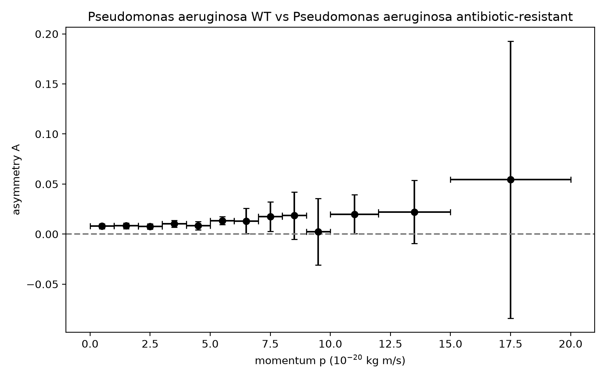
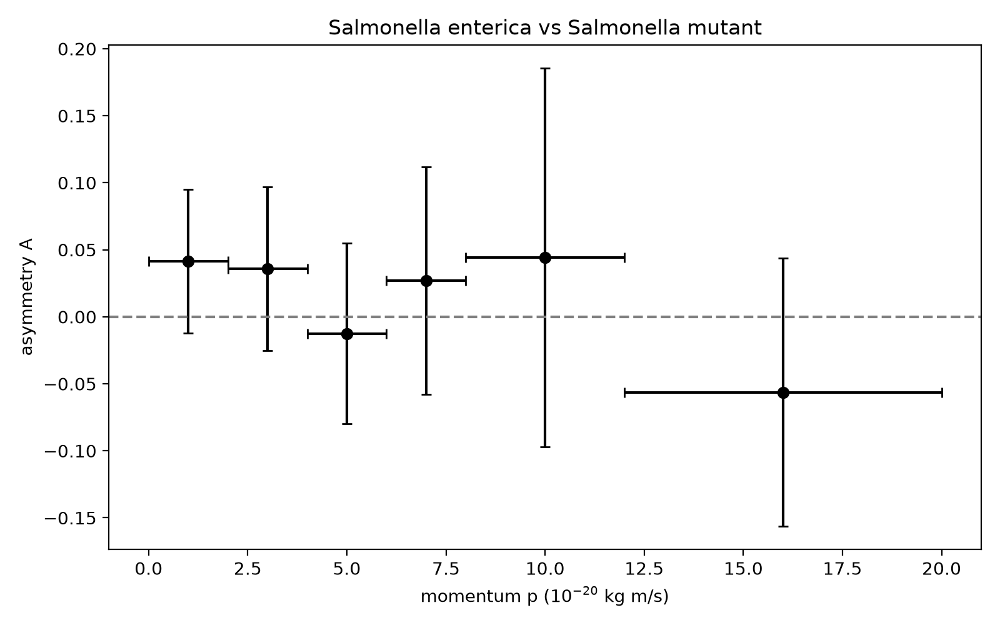

# Programming Lab - Biology Strain

A Python programme that reads simulation run data to be able to compare the population sizes and movements of normal bacteria compared to their mutants.

---

## Project Overview

### Context

In this project, we will analyse  simulation run data of bacterial cultures. Every run tracks individual cells, recording which strain they belong to and their momentum across three dimensions $(x, y, z)$ under controlled conditions.  

When comparing the wild-type (WT, positive IDs) to mutant strains (negative IDs) across different bacterial species, we want to see which strains dominate.

---

## Research Questions

1. **What are the average counts of each bacterial strain and their statistical uncertainties?**

*See the Method and Results sections below.*

2. **Is there any asymmetry between the normal and the mutant strain?**

  We quantify the relative population asymmetry ($A$):
  $$A = \frac{N_{\text{WT}} - N_{\text{Mutant}}}{N_{\text{WT}} + N_{\text{Mutant}}}$$
  
  Its statistical uncertainty $\sigma_A$ is determined with the same sub-sampling method as the average counts (see Method's section), and its significance is $|A| / \sigma_A$, the number of standard deviations the asymmetry lies away from zero.

3. **Is there any asymmetry as a function of their momentum? ($p = \sqrt{p_x^2 + p_y^2 + p_z^2}$)**

  The total momentum $p$ is computed for each cell, and then grouped in momentum bins. Within each group, the asymmetry $A$, and the uncertainty $\sigma_A$ between WT and mutant counts are calculated using the same method as above. This will make it possible to see whether the balance between the WT and the mutant strains shifts at different momentum ranges, rather than overall.  

---

## Dataset and Input

The data files used for the simulation follow a structured format that represents actual experiment runs. 

* **Header Row:**
  * Event ID: Unique identifier for the simulation run
  * Number of bacteria tracked: Total cell count.
* **Data Rows:**
  * Momentum components: $p_x$, $p_y$, $p_z$ (in units of $10^{-20}$ kg·m/s)
  * Bacterial ID: Numeric code denoting the bacterial strain. 

### Example Input File

```
1 29
0.153626 0.0787489 0.189973 -211
0.706237 0.293027 -0.188836 211
-0.195769 0.13282 -0.0321855 -211
-0.28052 0.0953441 0.235989 211
-0.174182 -0.401561 7.22433 211
0.100557 -0.302209 5.4045 -321
-0.155021 -0.185483 0.855223 321
-0.394574 0.00589716 1.70819 -321
-0.252323 -1.00072 2.8426 2212
...
```

Each row follows the format: `p_x p_y p_z Bacterial_ID`

A single file may contain many events (header, that many data rows, header, and so on), the full dataset consists of ten files, `output-Set1.txt` to `output-Set10.txt`, each containing 500,000 events in this format, meaning there are 5,000,000 events in total. 
The file `output-Set0.txt` is a small test file with a single event.

### Bacterial ID Reference

Every row in the data files ends with the ID that identifies the bacterial strain. The mapping used is:

| Bacterial ID | Bacterial strain |
| --- | --- |
| 211 | E. coli WT |
| -211 | E. coli mutant |
| 321 | Bacillus subtilis WT |
| -321 | Bacillus subtilis mutant |
| 2212 | Pseudomonas aeruginosa WT |
| -2212 | Pseudomonas aeruginosa antibiotic-resistant |
| 3122 | Streptococcus pneumoniae |
| -3122 | Capsule-deficient Streptococcus pneumoniae |
| 3312 | Mycobacterium tuberculosis |
| -3312 | Drug-resistant Mycobacterium tuberculosis |
| 3334 | Salmonella enterica |
| -3334 | Salmonella mutant |

---

## Method

### Counting

Every file is read one line at a time, so the whole 770 MB file never has to be fully stored. The header of each event gives the number of data rows there are, and the bacterial ID at the end of every row is checked against the 12 existing IDs in the table above (WT and mutant species are counted separately). Any other ID in these files will be ignored. Dividing the total count of an ID by the number of events in the file will give the average count per event of that ID. 

### Sub-sampling and statistical uncertainty

The statistical uncertainties are calculated with the sub-sampling method:

1. Every one of the ten files is analysed separately (one sub-sample is 500,000 events), which gives ten average counts per event for every ID. 
2. The central value is the average count per event over all the 5,000,000 events. Since all the ten sub-samples are the same size, this is just the plain mean of the ten sub-samples
3. The statistical uncertainty is the sample standard deviation (n - 1) of the ten sub-sample averages, meaning it is the spread of the sub-sample results.

The data is simulated, so no systematic uncertainty is needed.

### Asymmetry

The asymmetry is computed in two ways. 
The **total asymmetry** is one value for the whole pair: all WT and all mutant bacteria are counted together, the momentum isn't taken into account, and $A$ is calculated once. It verifies whether one strain dominates overall (Research Question 2).
The **asymmetry as a function of momentum** first categorises the bacteria into momentum bins, and then calculates $A$ separately in every bin. This calculation tells us whether the balance between the WT and the mutant is the same for slow and fast bacteria, or whether it changes with momentum (Research Question 3). By using the second method, it can uncover some effects that the total asymmetry might not be able to show. E.g. a positive asymmetry at low momentum and a negative one at high momentum could cancel out in the total.

The asymmetry $A$ is calculated for two WT / mutant pairs. *Pseudomonas aeruginosa* (2212 / -2212) and *Salmonella enterica* (3334 / -3334). For each file, $A$ is calculated from the average counts per event of the WT and the mutant. Dividing both counts by the same number of events does not change the $A$, so this gives the same value as using the raw counts. Following the sub-sampling method, the central value is the mean of the ten values of $A$, and the uncertainty is their standard deviation. The total asymmetry uses every bacterium of the pair, at all momenta. 

### Classification of momentum

For every bacterium of the pair, the total momentum $p = \sqrt{p_x^2 + p_y^2 + p_z^2}$ is calculated and the bacterium is placed in a bin with bacteria with similar momentum. Each bin includes its lower bound but not the upper bound, so every bacterium falls in exactly one bin. The bin edges used are:

* 2212 / -2212: 0, 1, 2, 3, 4, 5, 6, 7, 8, 9, 10, 12, 15, 20
* 3334 / -3334: 0, 2, 4, 6, 8, 12, 20

The bins are 1 unit wide at low momentum, where there are many bacteria, and wider at high momentum, where there are few. The *Salmonella* pair has far fewer bacteria in total, so it uses larger bins. Bacteria that are $p \geq 20$ fall outside the bins and are not included in the momentum analysis (around 70,000 per file for the *Pseudomonas*, which is around 6% of the file). They are not included because they are spread over a very wide range of momenta, so they would form a noisy bin.

In every bin, $A$ is calculated separately for each file, and the central value and uncertainty are again the mean and the  standard deviation of the ten files. Any file with no bacteria in a bin is skipped for that bin.

--- 

## Results

Average count per event of each bacterial strain (Research Question 1), from the analysis of all 5,000,000 events. Every value is given as central value ± statistical uncertainty. The units of the results are counts per event. 

| Bacterial ID | Bacterial strain | Average count per event |
| --- | --- | --- |
| 211 | E. coli WT | 18.425338 ± 0.027777 (stat) |
| -211 | E. coli mutant | 18.395508 ± 0.026927 (stat) |
| 321 | Bacillus subtilis WT | 2.317445 ± 0.004011 (stat) |
| -321 | Bacillus subtilis mutant | 2.312189 ± 0.004780 (stat) |
| 2212 | Pseudomonas aeruginosa WT | 1.115739 ± 0.001647 (stat) |
| -2212 | Pseudomonas aeruginosa antibiotic-resistant | 1.093689 ± 0.002087 (stat) |
| 3122 | Streptococcus pneumoniae | 0.255466 ± 0.000963 (stat) |
| -3122 | Capsule-deficient Streptococcus pneumoniae | 0.250938 ± 0.000891 (stat) |
| 3312 | Mycobacterium tuberculosis | 0.036428 ± 0.000254 (stat) |
| -3312 | Drug-resistant Mycobacterium tuberculosis | 0.036021 ± 0.000367 (stat) |
| 3334 | Salmonella enterica | 0.001096 ± 0.000038 (stat) |
| -3334 | Salmonella mutant | 0.001064 ± 0.000047 (stat) |

### Total asymmetry (Research Question 2)

| Pair | Asymmetry A | Significance |
| --- | --- | --- |
| Pseudomonas aeruginosa (2212 / -2212) | 0.009980 ± 0.000996 (stat) | 10.0 σ |
| Salmonella enterica (3334 / -3334) | 0.015341 ± 0.029303 (stat) | 0.5 σ |

### Asymmetry as a function of momentum (Research Question 3)

**Pseudomonas aeruginosa (2212 / -2212)**

| Momentum bin ($10^{-20}$ kg·m/s) | Asymmetry A |
| --- | --- |
| 0 - 1 | 0.00790 ± 0.00240 (stat) |
| 1 - 2 | 0.00822 ± 0.00300 (stat) |
| 2 - 3 | 0.00764 ± 0.00268 (stat) |
| 3 - 4 | 0.01020 ± 0.00332 (stat) |
| 4 - 5 | 0.00849 ± 0.00423 (stat) |
| 5 - 6 | 0.01333 ± 0.00395 (stat) |
| 6 - 7 | 0.01295 ± 0.01265 (stat) |
| 7 - 8 | 0.01738 ± 0.01467 (stat) |
| 8 - 9 | 0.01845 ± 0.02368 (stat) |
| 9 - 10 | 0.00229 ± 0.03329 (stat) |
| 10 - 12 | 0.01990 ± 0.01945 (stat) |
| 12 - 15 | 0.02211 ± 0.03155 (stat) |
| 15 - 20 | 0.05429 ± 0.13852 (stat) |



Each point is placed at the centre of its bin. The vertical error bars are the uncertainty, and the horizontal bars show the width of the bin. The dashed line at $A = 0$ marks no asymmetry.

**Salmonella enterica (3334 / -3334)**
 
| Momentum bin ($10^{-20}$ kg·m/s) | Asymmetry A |
| --- | --- |
| 0 - 2 | 0.04135 ± 0.05350 (stat) |
| 2 - 4 | 0.03589 ± 0.06098 (stat) |
| 4 - 6 | -0.01256 ± 0.06735 (stat) |
| 6 - 8 | 0.02694 ± 0.08479 (stat) |
| 8 - 12 | 0.04436 ± 0.14131 (stat) |
| 12 - 20 | -0.05640 ± 0.10006 (stat) |



Each point is placed at the centre of its momentum bin. The vertical error bars are the statistical uncertainty, and the horizontal bars show the width of the bin (not an uncertainty). The dashed line at $A = 0$ marks no asymmetry.

---

## Conclusion
 
**Research Question 2:** The *Pseudomonas aeruginosa* pair has a clear asymmetry: $A = 0.009980 \pm 0.000996$. This means there are about 2% more WT bacteria than antibiotic-resistant ones. The result is 10 times larger than its uncertainty, so it is almost impossible that this difference happened by random variation.

The *Salmonella enterica* pair has no clear asymmetry: $A = 0.015341 \pm 0.029303$. The uncertainty is larger than the result itself, meaning the result could also be zero. This is because there are about 1,000 times fewer *Salmonella* bacteria, and fewer bacteria means more random variation. The uncertainty (about 3%) is three times larger than the whole asymmetry we found for *Pseudomonas* (about 1%). So *Salmonella* could have a small asymmetry like *Pseudomonas*, but we do not have enough data to see it.

**Research Question 3:** For *Pseudomonas aeruginosa*, every bin from 0 to 6 has a positive asymmetry that lies 2 to 3.4 standard deviations from zero, so we can conclude that the WT outweighs the mutant at low momentum. Furthermore, the asymmetry seems to grow a little as momentum increases. However, above $p = 6$ the uncertainties become larger, meaning those points could be either zero, or the same as the low-momentum values. Because of this, we cannot say for sure that the asymmetry changes with momentum.
 
The large uncertainties at high momentum have two causes. The first one is that there are fewer bacteria at high momentum. The second is that the file `output-Set10.txt` has a different distribution of momentum from the other files. Almost all of its bacteria have low momentum ($p < 6$) and it has only 29 *Pseudomonas* bacteria between 15 and 20. As every file counts equally in the sub-sampling method, the very uncertain value from Set10 skews the spread in the highest bins. The low-momentum points, where every file has tens of thousands of bacteria, are the most reliable.
 
The uncertainty from the sub-sampling method shows how much the result of one file varies. The final result is the average of all ten files, which makes it more precise than a single file, so the real uncertainty is smaller. Our uncertainties are a bit larger than they need to be, meaning the *Pseudomonas* asymmetry is even clearer than our numbers show.

For *Salmonella enterica*, every momentum bin could be zero within its uncertainty, and the values go up and down without any pattern, meaning we cannot detect any asymmetry. This is probably due to each bin only having around 50 to 130 bacteria of each strain per file, so the uncertainties are large.

---

## Usage

### Prerequisites

* Python 3.10+
* A terminal on macOS, Linux, or Windows

### Cloning the Repository

```bash
  git clone https://github.com/ilannvw/Programming-Lab---Biology-Strain.git
```

### Dependencies

`main.py` only uses Python's built-in `math` and `statistics` packages, so no external libraries are needed for it. `asymmetry_momentum.py` uses `matplotlib` for the plot.

```bash
python3 -m pip install matplotlib
```

The data files are expected in a `data` folder, create it if it doesn't exist yet:

```bash
mkdir -p data
```
Windows equivalents:

```bash
mkdir data
```

Eleven data files are used:
- `data/output-Set0.txt`: single-event test file, used to check the momentum per cell calculation.
- `data/output-Set1.txt` to `data/output-Set10.txt`: the ten sub-samples of 500,000 events each. 

Each file is around 770 MB and is not included in this repository. Must be downloaded separately from the surfdrive provided in the course materials and placed in the `data` folder before running the code, otherwise it will not work.

Run the main analysis script:

```bash
python3 main.py
```
Windows equivalents:
```bash
python main.py
```

Run the asymmetry analysis (imports functions from `main.py`, so both files need to be in the same folder):

```bash
python3 asymmetry_momentum.py
```
Windows equivalents:
```bash
python asymmetry_momentum.py
```

To analyse the *Salmonella enterica* pair, change `WT_ID`, `MUTANT_ID`, `WT_NAME`, `MUTANT_NAME` and `BIN_EDGES` at the top of `asymmetry_momentum.py`, as described in the comments in that file.

---

### Output

Running `main.py`:

1. Reads a single event from `data/output-Set0.txt` and prints:
  - the event ID and the total number of bacteria tracked
  - for each bacterium: its bacterial ID and total momentum magnitude $p = \sqrt{p_x^2 + p_y^2 + p_z^2}$

2. Reads all 500,000 events from `data/output-Set6.txt` and prints:
  - the average count of all 12 IDs, as an example of a single sub-sample
  - the statistical uncertainty, calculated from the Poisson statistics on the total count summed across all the events

3. Analyses all ten files separately and prints a table with the average count per event of each of the 12 bacterial IDs over the 5,000,000 events, with the statistical uncertainty from the sub-sampling method (table in the Results section).

Running `asymmetry_momentum.py`:

1. Prints the average count per event of the WT and the mutant of the pair, with the sub-sampling uncertainty.
2. Prints the total asymmetry $A$ with its uncertainty and its significance in standard deviations.
3. Prints the WT and mutant counts per momentum bin for every file, and the number of bacteria outside the bins.
4. Prints a table with the asymmetry in every momentum bin, and saves and shows the plot as `asymmetry_<wild type ID>.png` (e.g. `asymmetry_2212.png`). The programme keeps running until the plot window is closed.

---

**Course:** Programming (PRA2003) | Maastricht University
**Author:** Barbara Andody, Małgorzata Fic, Kristofer Katisko, Ilan Noè
**Date:** October 2026